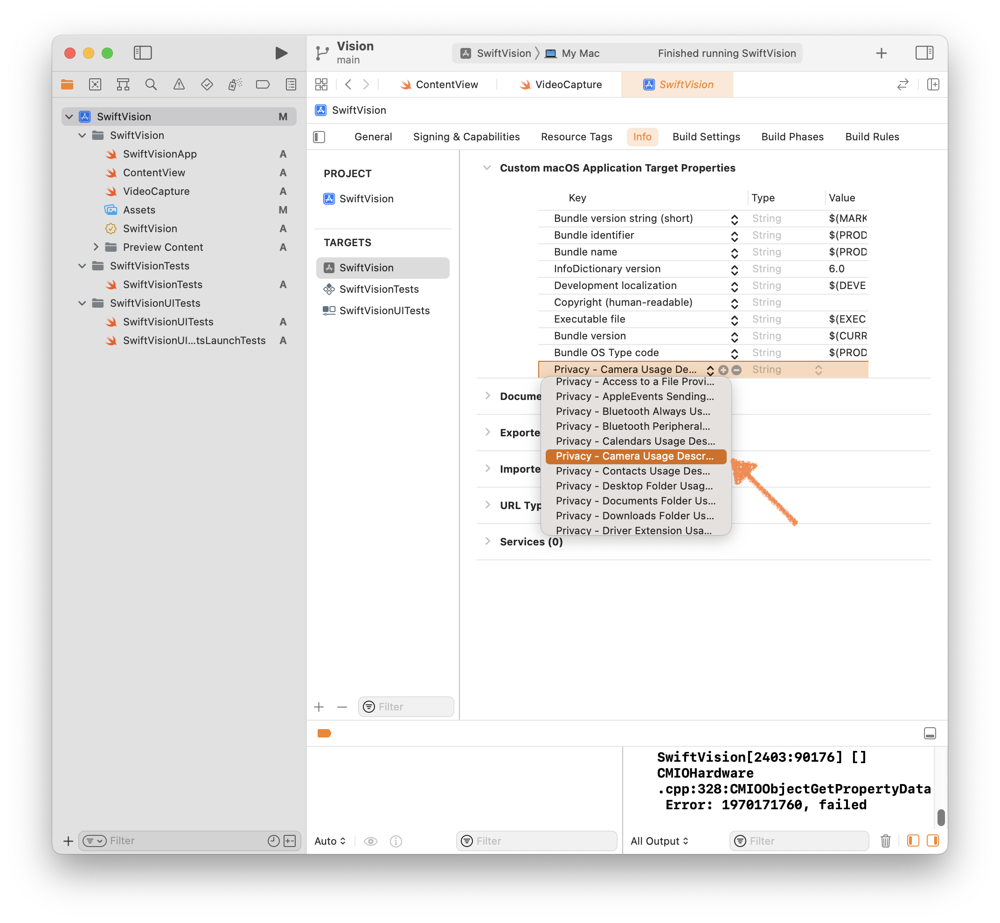

# Introduction

Capturing video frames from the built-in and external cameras is pretty easy on macOS. In this tutorial, I will show how to accomplish this using the AVFoundation framework, and to display the results with SwiftUI. This simple app displays the video stream, and allows the user to switch amongst available cameras, including USB attached web cameras.

The source project for this tutorial has been pushed to git and can be cloned with this:

```bash
git clone https://github.com/CircuitLaunch/SwiftUIVideoCap.git
```

# Create a New Xcode Project

Hit ⇧⌘N in Xcode to create a new project. Select `macOS→App` and hit `Next` in the template chooser.


Name your project, and configure the team, and identifier if you have them. The interface setting is SwiftUI, and we will be implementing this in the Swift language. Hit `Next`.


# Define the VideoCapture Class

Once the new project opens, hit ⌘N to create a new Swift file named `VideoCapture`.


Import the `AVFoundation` framework and create a new class named `VideoCapture` which inherits from `NSObject`.

```swift
//
//  VideoCapture.swift
//  SwiftVision
//
//  Created by Edward Janne on 10/24/22.
//

import Foundation
import AVFoundation

class VideoCapture : NSObject {
}
```

Add three properties as follows. The `AVCaptureSession` class manages media capture, which, in addition to video, includes audio, closed-captioning and subtitles, timecode, and depth telemetry. The `AVCaptureVideoDataOutput` class provides an interface for extracting image frames from capture streams. The `captureQueue` object allows the video capture to be performed on an independent thread in the background.

```swift
//
//  VideoCapture.swift
//  SwiftVision
//
//  Created by Edward Janne on 10/24/22.
//

import Foundation
import AVFoundation

class VideoCapture : NSObject {
		private let captureSession = AVCaptureSession()
    private let sessionOutput = AVCaptureVideoDataOutput()
    private let captureQueue = DispatchQueue(label: "VideoDataOutput")
}
```

Create a new function called `start()` in which we do some initial housecleaning.

```swift
//
//  VideoCapture.swift
//  SwiftVision
//
//  Created by Edward Janne on 10/24/22.
//

import Foundation
import AVFoundation

class VideoCapture : NSObject {
		private let captureSession = AVCaptureSession()
    private let sessionOutput = AVCaptureVideoDataOutput()
    private let captureQueue = DispatchQueue(label: "VideoDataOutput")

		// Start a capture session using the camera with the specified camera id
		func start(using cameraId: String) {
				// If there is an active capture session
				if captureSession.isRunning {
						// Stop it
            captureSession.stopRunning()
						// Disconnect the output
            captureSession.removeOutput(sessionOutput)
						// Disconnect any inputs
            let inputs = captureSession.inputs
            for oldInput in inputs {
                captureSession.removeInput(oldInput)
            }
        }
		}
}
```

Ask the user for permission to access the camera.

```swift
//
//  VideoCapture.swift
//  SwiftVision
//
//  Created by Edward Janne on 10/24/22.
//

import Foundation
import AVFoundation

class VideoCapture : NSObject {
		private let captureSession = AVCaptureSession()
    private let sessionOutput = AVCaptureVideoDataOutput()
    private let captureQueue = DispatchQueue(label: "VideoDataOutput")

		// Start a capture session using the camera with the specified camera id
		func start(using cameraId: String) {
				// If there is an active capture session
				if captureSession.isRunning {
						// Stop it
            captureSession.stopRunning()
						// Disconnect the output
            captureSession.removeOutput(sessionOutput)
						// Disconnect any inputs
            let inputs = captureSession.inputs
            for oldInput in inputs {
                captureSession.removeInput(oldInput)
            }
        }
				
				// Request permission to access the camera if needed
        var allowed = false
        let modal = DispatchGroup()
        modal.enter()
        AVCaptureDevice.requestAccess(for: .video) {
						flag in
            allowed = flag
            modal.leave()
        }
        modal.wait()
		}
}
```

Next, check that permission was granted, and that the specified device exists and the input and output are usable.

```swift
//
//  VideoCapture.swift
//  SwiftVision
//
//  Created by Edward Janne on 10/24/22.
//

import Foundation
import AVFoundation

class VideoCapture : NSObject {
		private let captureSession = AVCaptureSession()
    private let sessionOutput = AVCaptureVideoDataOutput()
    private let captureQueue = DispatchQueue(label: "VideoDataOutput")

		// Start a capture session using the camera with the specified camera id
		func start(using cameraId: String) {
				// If there is an active capture session
				if captureSession.isRunning {
						// Stop it
            captureSession.stopRunning()
						// Disconnect the output
            captureSession.removeOutput(sessionOutput)
						// Disconnect any inputs
            let inputs = captureSession.inputs
            for oldInput in inputs {
                captureSession.removeInput(oldInput)
            }
        }
				
				// Request permission to access the camera if needed
        var allowed = false
        let modal = DispatchGroup()
        modal.enter()
        AVCaptureDevice.requestAccess(for: .video) {
						flag in
            allowed = flag
            modal.leave()
        }
        modal.wait()

				// Abort if permission was denied
        guard allowed else {
            print("Video capture permissions failure")
            return
        }
        
        // Abort if no device with the specified ID exists
        guard let device = AVCaptureDevice(uniqueID: cameraId) else {
            print("Failed to access camera")
            return
        }
        
        // Abort if the device's input is inaccessible
        guard let deviceInput = try? AVCaptureDeviceInput(device: device) else {
            print("Failed to access device input")
            return
        }
        
        // Abort if the device's input cannot be used
        guard captureSession.canAddInput(deviceInput) else {
            print("Failed to add device input to session")
            return
        }
        
        // Abort if the output cannot be attached to the session
        guard captureSession.canAddOutput(sessionOutput) else {
            print("Failed to add device output to session")
            return
        }
		}
}
```

Rounding out the `start()` function, we configure the session, and finally, start it.

```swift
//
//  VideoCapture.swift
//  SwiftVision
//
//  Created by Edward Janne on 10/24/22.
//

import Foundation
import AVFoundation

class VideoCapture : NSObject {
		private let captureSession = AVCaptureSession()
    private let sessionOutput = AVCaptureVideoDataOutput()
    private let captureQueue = DispatchQueue(label: "VideoDataOutput")

		// Start a capture session using the camera with the specified camera id
		func start(using cameraId: String) {
				// If there is an active capture session
				if captureSession.isRunning {
						// Stop it
            captureSession.stopRunning()
						// Disconnect the output
            captureSession.removeOutput(sessionOutput)
						// Disconnect any inputs
            let inputs = captureSession.inputs
            for oldInput in inputs {
                captureSession.removeInput(oldInput)
            }
        }
				
				// Request permission to access the camera if needed
        var allowed = false
        let modal = DispatchGroup()
        modal.enter()
        AVCaptureDevice.requestAccess(for: .video) {
						flag in
            allowed = flag
            modal.leave()
        }
        modal.wait()

				// Abort if permission was denied
        guard allowed else {
            print("Video capture permissions failure")
            return
        }
        
        // Abort if no device with the specified ID exists
        guard let device = AVCaptureDevice(uniqueID: cameraId) else {
            print("Failed to access camera")
            return
        }
        
        // Abort if the device's input is inaccessible
        guard let deviceInput = try? AVCaptureDeviceInput(device: device) else {
            print("Failed to access device input")
            return
        }
        
        // Abort if the device's input cannot be used
        guard captureSession.canAddInput(deviceInput) else {
            print("Failed to add device input to session")
            return
        }
        
        // Abort if the output cannot be attached to the session
        guard captureSession.canAddOutput(sessionOutput) else {
            print("Failed to add device output to session")
            return
        }
				
				// Begin configuring the session
        captureSession.beginConfiguration()
        
				// Add the input and output
        captureSession.addInput(deviceInput)
        captureSession.addOutput(sessionOutput)
        
        // Configure the output to discard late frames
        sessionOutput.alwaysDiscardsLateVideoFrames = true
        // Configure the output video color format
        sessionOutput.videoSettings = [kCVPixelBufferPixelFormatTypeKey as String: Int(kCVPixelFormatType_420YpCbCr8BiPlanarFullRange)]
        // Set this object as the delegate, and specify the
        // dispatch queue on which frames will be delivered
        sessionOutput.setSampleBufferDelegate(self, queue: captureQueue)
        
        // Enable the connection between the camera and the output
        if let connection = sessionOutput.connection(with: .video) {
            connection.isEnabled = true
        }
				
        // Finalize the configuration
        captureSession.commitConfiguration()
				
				// Start the session
        captureSession.startRunning()
		}
}
```

We need a few more things.

1. A function to stop capturing;
2. To somehow allow SwiftUI access to the captured frames. This can be accomplished with a closure; and
3. To implement the `AVCaptureVideoDataOutputSampleBufferDelegate` protocol, which is how AVFoundation will return the captured frames to us, namely, the `captureOutput(_: , didOutput:, from:)` and `captureOutput(_:, didOutput:, from:)` methods.

1. Let’s first add a `stop()` function.
    
    ```swift
    //
    //  VideoCapture.swift
    //  SwiftVision
    //
    //  Created by Edward Janne on 10/24/22.
    //
    
    import Foundation
    import AVFoundation
    
    class VideoCapture : NSObject {
    		private let captureSession = AVCaptureSession()
        private let sessionOutput = AVCaptureVideoDataOutput()
        private let captureQueue = DispatchQueue(label: "VideoDataOutput")
    
    		// Start a capture session using the camera with the specified camera id
    		func start(using cameraId: String) {
    				// If there is an active capture session
    				if captureSession.isRunning {
    						// Stop it
                captureSession.stopRunning()
    						// Disconnect the output
                captureSession.removeOutput(sessionOutput)
    						// Disconnect any inputs
                let inputs = captureSession.inputs
                for oldInput in inputs {
                    captureSession.removeInput(oldInput)
                }
            }
    				
    				// Request permission to access the camera if needed
            var allowed = false
            let modal = DispatchGroup()
            modal.enter()
            AVCaptureDevice.requestAccess(for: .video) {
    						flag in
                allowed = flag
                modal.leave()
            }
            modal.wait()
    
    				// Abort if permission was denied
            guard allowed else {
                print("Video capture permissions failure")
                return
            }
            
            // Abort if no device with the specified ID exists
            guard let device = AVCaptureDevice(uniqueID: cameraId) else {
                print("Failed to access camera")
                return
            }
            
            // Abort if the device's input is inaccessible
            guard let deviceInput = try? AVCaptureDeviceInput(device: device) else {
                print("Failed to access device input")
                return
            }
            
            // Abort if the device's input cannot be used
            guard captureSession.canAddInput(deviceInput) else {
                print("Failed to add device input to session")
                return
            }
            
            // Abort if the output cannot be attached to the session
            guard captureSession.canAddOutput(sessionOutput) else {
                print("Failed to add device output to session")
                return
            }
    				
    				// Begin configuring the session
            captureSession.beginConfiguration()
            
    				// Add the input and output
            captureSession.addInput(deviceInput)
            captureSession.addOutput(sessionOutput)
            
            // Configure the output to discard late frames
            sessionOutput.alwaysDiscardsLateVideoFrames = true
            // Configure the output video color format
            sessionOutput.videoSettings = [kCVPixelBufferPixelFormatTypeKey as String: Int(kCVPixelFormatType_420YpCbCr8BiPlanarFullRange)]
            // Set this object as the delegate, and specify the
            // dispatch queue on which frames will be delivered
            sessionOutput.setSampleBufferDelegate(self, queue: captureQueue)
            
            // Enable the connection between the camera and the output
            if let connection = sessionOutput.connection(with: .video) {
                connection.isEnabled = true
            }
    				
            // Finalize the configuration
            captureSession.commitConfiguration()
    				
    				// Start the session
            captureSession.startRunning()
    		}
    		
    		// Terminate the session if it is active
        func stop() {
            if captureSession.isRunning {
                captureSession.stopRunning()
            }
        }
     }
    ```
    
2. Next, add a private optional variable to store a closure. The closure accepts an optional `CVImageBuffer` as an argument, and has no return type. Then add a function to allow another object to set this closure. Why use a closure? Capturing video is a function that has many applications, not just vision. The point of object oriented programming is to encapsulate as much common functionality into superclasses which can be reused with as little recoding as possible. There are a few ways to customize behavior. One way would be to subclass `VideoCapture` and override some function. That sill requires a completely new class, with some memory and function calling overhead, which seems like a waste just to override one function. A much more efficient way is just to provide a callback (aka a closure) to allow customization of behavior. This has been one of the primary programming paradigms in Swift, and is utilized heavily in SwiftUI.
    
    ```swift
    //
    //  VideoCapture.swift
    //  SwiftVision
    //
    //  Created by Edward Janne on 10/24/22.
    //
    
    import Foundation
    import AVFoundation
    
    class VideoCapture : NSObject {
    		private let captureSession = AVCaptureSession()
        private let sessionOutput = AVCaptureVideoDataOutput()
        private let captureQueue = DispatchQueue(label: "VideoDataOutput")
    
    		// Start a capture session using the camera with the specified camera id
    		func start(using cameraId: String) {
    				// If there is an active capture session
    				if captureSession.isRunning {
    						// Stop it
                captureSession.stopRunning()
    						// Disconnect the output
                captureSession.removeOutput(sessionOutput)
    						// Disconnect any inputs
                let inputs = captureSession.inputs
                for oldInput in inputs {
                    captureSession.removeInput(oldInput)
                }
            }
    				
    				// Request permission to access the camera if needed
            var allowed = false
            let modal = DispatchGroup()
            modal.enter()
            AVCaptureDevice.requestAccess(for: .video) {
    						flag in
                allowed = flag
                modal.leave()
            }
            modal.wait()
    
    				// Abort if permission was denied
            guard allowed else {
                print("Video capture permissions failure")
                return
            }
            
            // Abort if no device with the specified ID exists
            guard let device = AVCaptureDevice(uniqueID: cameraId) else {
                print("Failed to access camera")
                return
            }
            
            // Abort if the device's input is inaccessible
            guard let deviceInput = try? AVCaptureDeviceInput(device: device) else {
                print("Failed to access device input")
                return
            }
            
            // Abort if the device's input cannot be used
            guard captureSession.canAddInput(deviceInput) else {
                print("Failed to add device input to session")
                return
            }
            
            // Abort if the output cannot be attached to the session
            guard captureSession.canAddOutput(sessionOutput) else {
                print("Failed to add device output to session")
                return
            }
    				
    				// Begin configuring the session
            captureSession.beginConfiguration()
            
    				// Add the input and output
            captureSession.addInput(deviceInput)
            captureSession.addOutput(sessionOutput)
            
            // Configure the output to discard late frames
            sessionOutput.alwaysDiscardsLateVideoFrames = true
            // Configure the output video color format
            sessionOutput.videoSettings = [kCVPixelBufferPixelFormatTypeKey as String: Int(kCVPixelFormatType_420YpCbCr8BiPlanarFullRange)]
            // Set this object as the delegate, and specify the
            // dispatch queue on which frames will be delivered
            sessionOutput.setSampleBufferDelegate(self, queue: captureQueue)
            
            // Enable the connection between the camera and the output
            if let connection = sessionOutput.connection(with: .video) {
                connection.isEnabled = true
            }
    				
            // Finalize the configuration
            captureSession.commitConfiguration()
    				
    				// Start the session
            captureSession.startRunning()
    		}
    		
    		// Terminate the session if it is active
        func stop() {
            if captureSession.isRunning {
                captureSession.stopRunning()
            }
        }
    
    		// Closure to be called when a frame is captured
        private var _onCapturedImage: ((CVImageBuffer?)->())? = nil
        
        // Function to enable other objects to attach the closure
        @discardableResult func onCapturedImage(_ c: ((CVImageBuffer?)->())?)->VideoCapture {
            _onCapturedImage = c
            return self
        }
    }
    ```
    
3. Finally, we need to implement the `AVCaptureVideoDataOutputSampleBufferDelegate` protocol. This protocol declares two functions which must be implemented in a concrete class which `AVCaptureSession` will call back to pass us video frames. A common pattern in Swift is to implement protocols in extensions. This is not strictly necessary, but makes for more readable and manageable code.
    
    ```swift
    //
    //  VideoCapture.swift
    //  SwiftVision
    //
    //  Created by Edward Janne on 10/24/22.
    //
    
    import Foundation
    import AVFoundation
    
    class VideoCapture : NSObject {
    		private let captureSession = AVCaptureSession()
        private let sessionOutput = AVCaptureVideoDataOutput()
        private let captureQueue = DispatchQueue(label: "VideoDataOutput")
    
    		// Start a capture session using the camera with the specified camera id
    		func start(using cameraId: String) {
    				// If there is an active capture session
    				if captureSession.isRunning {
    						// Stop it
                captureSession.stopRunning()
    						// Disconnect the output
                captureSession.removeOutput(sessionOutput)
    						// Disconnect any inputs
                let inputs = captureSession.inputs
                for oldInput in inputs {
                    captureSession.removeInput(oldInput)
                }
            }
    				
    				// Request permission to access the camera if needed
            var allowed = false
            let modal = DispatchGroup()
            modal.enter()
            AVCaptureDevice.requestAccess(for: .video) { flag in
                allowed = flag
                modal.leave()
            }
            modal.wait()
    
    				// Abort if permission was denied
            guard allowed else {
                print("Video capture permissions failure")
                return
            }
            
            // Abort if no device with the specified ID exists
            guard let device = AVCaptureDevice(uniqueID: cameraId) else {
                print("Failed to access camera")
                return
            }
            
            // Abort if the device's input is inaccessible
            guard let deviceInput = try? AVCaptureDeviceInput(device: device) else {
                print("Failed to access device input")
                return
            }
            
            // Abort if the device's input cannot be used
            guard captureSession.canAddInput(deviceInput) else {
                print("Failed to add device input to session")
                return
            }
            
            // Abort if the output cannot be attached to the session
            guard captureSession.canAddOutput(sessionOutput) else {
                print("Failed to add device output to session")
                return
            }
    				
    				// Begin configuring the session
            captureSession.beginConfiguration()
            
    				// Add the input and output
            captureSession.addInput(deviceInput)
            captureSession.addOutput(sessionOutput)
            
            // Configure the output to discard late frames
            sessionOutput.alwaysDiscardsLateVideoFrames = true
            // Configure the output video color format
            sessionOutput.videoSettings = [kCVPixelBufferPixelFormatTypeKey as String: Int(kCVPixelFormatType_420YpCbCr8BiPlanarFullRange)]
            // Set this object as the delegate, and specify the
            // dispatch queue on which frames will be delivered
            sessionOutput.setSampleBufferDelegate(self, queue: captureQueue)
            
            // Enable the connection between the camera and the output
            if let connection = sessionOutput.connection(with: .video) {
                connection.isEnabled = true
            }
    				
            // Finalize the configuration
            captureSession.commitConfiguration()
    				
    				// Start the session
            captureSession.startRunning()
    		}
    		
    		// Terminate the session if it is active
        func stop() {
            if captureSession.isRunning {
                captureSession.stopRunning()
            }
        }
    
    		// Closure to be called when a frame is captured
        private var _onCapturedImage: ((CVImageBuffer?)->())? = nil
        
        // Function to enable other objects to attach the closure
        @discardableResult func onCapturedImage(_ c: ((CVImageBuffer?)->())?)->VideoCapture {
            _onCapturedImage = c
            return self
        }
    }
    
    // Implemention of protocol AVCaptureVideoDataOutputSampleBufferDelegate
    extension VideoCapture: AVCaptureVideoDataOutputSampleBufferDelegate {   
        // AVFoundation will call this function when a frame is available
        func captureOutput(_ output: AVCaptureOutput, didOutput sampleBuffer: CMSampleBuffer, from connection: AVCaptureConnection) {
            // Ensure we receive a valid buffer before passing it to the closure
    				guard let pixelBuffer = CMSampleBufferGetImageBuffer(sampleBuffer) else {
                return
            }
    				// Call closure if available
            self._onCapturedImage?(pixelBuffer)
        }
        
        // Implemention of protocol AVCaptureVideoDataOutputSampleBufferDelegate
        // AVFoundation will call this function when a frame has been dropped
        func captureOutput(_ captureOutput: AVCaptureOutput, didDrop didDropSampleBuffer: CMSampleBuffer, from connection: AVCaptureConnection) {
            print("Dropped frame")
        }
    }
    ```
    

# Create the User Interface with SwiftUI

To create the UI, we will modify the ContentView structure.


Import the AVFoundation.framework at the top of the file.

Instantiate a `VideoCapture` object and a shared `CIContext` at the global scope.

```swift
//
//  ContentView.swift
//  SwiftVision
//
//  Created by Edward Janne on 10/24/22.
//

import SwiftUI
import AVFoundation

// Instantiate a VideoCapture object
let videoCapture = VideoCapture()

// Create a CoreImage context for image manipulation
let sharedContext = CIContext(options: [.useSoftwareRenderer: false])

struct ContentView: View {
    var body: some View {
        Text("Hello, world!")
            .padding()
    }
}

struct ContentView_Previews: PreviewProvider {
    static var previews: some View {
        ContentView()
    }
}
```

Populate the structure with properties to store information about available cameras, as well as the captured frame.

```swift
//
//  ContentView.swift
//  SwiftVision
//
//  Created by Edward Janne on 10/24/22.
//

import SwiftUI
import AVFoundation

// Instantiate a VideoCapture object
let videoCapture = VideoCapture()

// Create a CoreImage context for image manipulation
let sharedContext = CIContext(options: [.useSoftwareRenderer: false])

struct ContentView: View {

		// An array to store the names of available cameras
    @State private var cameraNames = [String]()
    // A map to associate names with camera ids
    @State private var cameraIds = [String:String]()
    // The name of the currently selected camera
    @State private var selectedCamera = "FaceTime HD Camera"
    
    // The bounds of the captured frames
    @State var bounds = CGRect(x:0.0, y:0.0, width:100.0, height:100.0)
    // The scaling factor for display
    @State var scale: Double = 0.333333333
    
    // The currently captured frame as an NSImage
    @State private var nsImage = NSImage()

    var body: some View {
        Text("Hello, world!")
            .padding()
    }
}

struct ContentView_Previews: PreviewProvider {
    static var previews: some View {
        ContentView()
    }
}
```

In the body of the `ContentView`, replace the default `Text` view with a `VStack` containing a `Picker`, and an `Image`.

The `Picker`’s label is “Cameras”, and its current selection is specified by `$selectedCamera`. Variables declared with the `@State` wrapper indicate that they are sources of truth to SwiftUI. Passing the variable to a SwiftUI view prefixed with the ‘$’ symbol establishes a multi-way connection such that when the value is changed, all views referencing the variable are updated automatically.

The `Image` view accepts `nsImage` as a source of truth. It doesn’t need to be prefixed with a ‘$’ because the `Image` view will not change the value. But the `Image` view will still be updated when the value of `nsImage` changes.

```swift
//
//  ContentView.swift
//  SwiftVision
//
//  Created by Edward Janne on 10/24/22.
//

import SwiftUI
import AVFoundation

// Instantiate a VideoCapture object
let videoCapture = VideoCapture()

// Create a CoreImage context for image manipulation
let sharedContext = CIContext(options: [.useSoftwareRenderer: false])

struct ContentView: View {

		// An array to store the names of available cameras
    @State private var cameraNames = [String]()
    // A map to associate names with camera ids
    @State private var cameraIds = [String:String]()
    // The name of the currently selected camera
    @State private var selectedCamera = "FaceTime HD Camera"
    
    // The bounds of the captured frames
    @State var bounds = CGRect(x:0.0, y:0.0, width:100.0, height:100.0)
    // The scaling factor for display
    @State var scale: Double = 0.333333333
    
    // The currently captured frame as an NSImage
    @State private var nsImage = NSImage()

    var body: some View {
				// Vertical stack containing a Picker, and an Image
        VStack(spacing: 0.0) {
						// Create a Picker named "Cameras" and bind
            // selectedCamera to its selection variable
            Picker("Cameras", selection: $selectedCamera) {
            }
                .pickerStyle(.segmented)
                .padding(10)
						// Image to display the captured frames
            Image(nsImage: nsImage)
        }
						.padding()
    }
}

struct ContentView_Previews: PreviewProvider {
    static var previews: some View {
        ContentView()
    }
}
```

Populate the `Picker` using a SwiftUI `ForEach` view that iteratively generates `TextView`s from the `cameraNames` array.

```swift
//
//  ContentView.swift
//  SwiftVision
//
//  Created by Edward Janne on 10/24/22.
//

import SwiftUI
import AVFoundation

// Instantiate a VideoCapture object
let videoCapture = VideoCapture()

// Create a CoreImage context for image manipulation
let sharedContext = CIContext(options: [.useSoftwareRenderer: false])

struct ContentView: View {

		// An array to store the names of available cameras
    @State private var cameraNames = [String]()
    // A map to associate names with camera ids
    @State private var cameraIds = [String:String]()
    // The name of the currently selected camera
    @State private var selectedCamera = "FaceTime HD Camera"
    
    // The bounds of the captured frames
    @State var bounds = CGRect(x:0.0, y:0.0, width:100.0, height:100.0)
    // The scaling factor for display
    @State var scale: Double = 0.333333333
    
    // The currently captured frame as an NSImage
    @State private var nsImage = NSImage()

    var body: some View {
				// Vertical stack containing a Picker, and an Image
        VStack(spacing: 0.0) {
						// Create a Picker named "Cameras" and bind
            // selectedCamera to its selection variable
            Picker("Cameras", selection: $selectedCamera) {
								// Populate the picker with the camera names
								ForEach(cameraNames, id: \.self) { name in
										// The displayed text is the name of each camera
										// The tag is the value to return in selectedCamera
										// when the user picks an option; in this case is
										// also the camera name
                    Text(name).tag(name)
                }
            }
                .pickerStyle(.segmented)
                .padding(10)
						// Image to display the captured frames
            Image(nsImage: nsImage)
        }
						.padding()
    }
}

struct ContentView_Previews: PreviewProvider {
    static var previews: some View {
        ContentView()
    }
}
```

Add two modifiers to the `Image` view.

```swift
//
//  ContentView.swift
//  SwiftVision
//
//  Created by Edward Janne on 10/24/22.
//

import SwiftUI
import AVFoundation

// Instantiate a VideoCapture object
let videoCapture = VideoCapture()

// Create a CoreImage context for image manipulation
let sharedContext = CIContext(options: [.useSoftwareRenderer: false])

struct ContentView: View {

		// An array to store the names of available cameras
    @State private var cameraNames = [String]()
    // A map to associate names with camera ids
    @State private var cameraIds = [String:String]()
    // The name of the currently selected camera
    @State private var selectedCamera = "FaceTime HD Camera"
    
    // The bounds of the captured frames
    @State var bounds = CGRect(x:0.0, y:0.0, width:100.0, height:100.0)
    // The scaling factor for display
    @State var scale: Double = 0.333333333
    
    // The currently captured frame as an NSImage
    @State private var nsImage = NSImage()

    var body: some View {
				// Vertical stack containing a Picker, and an Image
        VStack(spacing: 0.0) {
						// Create a Picker named "Cameras" and bind
            // selectedCamera to its selection variable
            Picker("Cameras", selection: $selectedCamera) {
								// Populate the picker with the camera names
								ForEach(cameraNames, id: \.self) { name in
										// The displayed text is the name of each camera
										// The tag is the value to return in selectedCamera
										// when the user picks an option; in this case is
										// also the camera name
                    Text(name).tag(name)
                }
            }
                .pickerStyle(.segmented)
                .padding(10)
						// Image to display the captured frames
            Image(nsImage: nsImage)
								.onAppear {
                    }
                .onChange(of: selectedCamera) { newValue in
                    }
        }
						.padding()
    }
}

struct ContentView_Previews: PreviewProvider {
    static var previews: some View {
        ContentView()
    }
}
```

`.onAppear` is called once when the view first appears. This is a good place to detect the number of cameras attached to the system.

```swift
//
//  ContentView.swift
//  SwiftVision
//
//  Created by Edward Janne on 10/24/22.
//

import SwiftUI
import AVFoundation

// Instantiate a VideoCapture object
let videoCapture = VideoCapture()

// Create a CoreImage context for image manipulation
let sharedContext = CIContext(options: [.useSoftwareRenderer: false])

struct ContentView: View {

		// An array to store the names of available cameras
    @State private var cameraNames = [String]()
    // A map to associate names with camera ids
    @State private var cameraIds = [String:String]()
    // The name of the currently selected camera
    @State private var selectedCamera = "FaceTime HD Camera"
    
    // The bounds of the captured frames
    @State var bounds = CGRect(x:0.0, y:0.0, width:100.0, height:100.0)
    // The scaling factor for display
    @State var scale: Double = 0.333333333
    
    // The currently captured frame as an NSImage
    @State private var nsImage = NSImage()

    var body: some View {
				// Vertical stack containing a Picker, and an Image
        VStack(spacing: 0.0) {
						// Create a Picker named "Cameras" and bind
            // selectedCamera to its selection variable
            Picker("Cameras", selection: $selectedCamera) {
								// Populate the picker with the camera names
								ForEach(cameraNames, id: \.self) { name in
										// The displayed text is the name of each camera
										// The tag is the value to return in selectedCamera
										// when the user picks an option; in this case is
										// also the camera name
                    Text(name).tag(name)
                }
            }
                .pickerStyle(.segmented)
                .padding(10)
						// Image to display the captured frames
            Image(nsImage: nsImage)
								.onAppear {
												// Get a list of attached cameras
												let discoveredCameraList = 
													AVCaptureDevice.DiscoverySession(
														deviceTypes: [.builtInWideAngleCamera, .externalUnknown],
														mediaType: .video, 
														position: .unspecified
													).devices
												// Populate the names array and the name:id map
		                    for discovered in discoveredCameraList {
		                        cameraNames.append(discovered.localizedName)
		                        cameraIds[discovered.localizedName] = discovered.uniqueID
		                    }
                    }
                .onChange(of: selectedCamera) { newValue in
                    }
        }
						.padding()
    }
}

struct ContentView_Previews: PreviewProvider {
    static var previews: some View {
        ContentView()
    }
}
```

Next, we attach a closure to handle incoming video frames. This is the exciting part. Within the closure, we encapsulate the image buffer returned by `AVFoundation` in a `CIImage`, which we scale by a desired amount, and then convert it to an `NSImage` suitable for display by SwiftUI. We trigger a UI update by setting the `bounds` variable.

```swift
//
//  ContentView.swift
//  SwiftVision
//
//  Created by Edward Janne on 10/24/22.
//

import SwiftUI
import AVFoundation

// Instantiate a VideoCapture object
let videoCapture = VideoCapture()

// Create a CoreImage context for image manipulation
let sharedContext = CIContext(options: [.useSoftwareRenderer: false])

struct ContentView: View {

		// An array to store the names of available cameras
    @State private var cameraNames = [String]()
    // A map to associate names with camera ids
    @State private var cameraIds = [String:String]()
    // The name of the currently selected camera
    @State private var selectedCamera = "FaceTime HD Camera"
    
    // The bounds of the captured frames
    @State var bounds = CGRect(x:0.0, y:0.0, width:100.0, height:100.0)
    // The scaling factor for display
    @State var scale: Double = 0.333333333
    
    // The currently captured frame as an NSImage
    @State private var nsImage = NSImage()

    var body: some View {
				// Vertical stack containing a Picker, and an Image
        VStack(spacing: 0.0) {
						// Create a Picker named "Cameras" and bind
            // selectedCamera to its selection variable
            Picker("Cameras", selection: $selectedCamera) {
								// Populate the picker with the camera names
								ForEach(cameraNames, id: \.self) { name in
										// The displayed text is the name of each camera
										// The tag is the value to return in selectedCamera
										// when the user picks an option; in this case is
										// also the camera name
                    Text(name).tag(name)
                }
            }
                .pickerStyle(.segmented)
                .padding(10)
						// Image to display the captured frames
            Image(nsImage: nsImage)
								.onAppear {
												// Get a list of attached cameras
												let discoveredCameraList = 
													AVCaptureDevice.DiscoverySession(
														deviceTypes: [.builtInWideAngleCamera, .externalUnknown],
														mediaType: .video, 
														position: .unspecified
													).devices
												// Populate the names array and the name:id map
		                    for discovered in discoveredCameraList {
		                        cameraNames.append(discovered.localizedName)
		                        cameraIds[discovered.localizedName] = discovered.uniqueID
		                    }

												// Attach a closure to the videoCapture object  handle incoming frames
                        videoCapture
                            .onCapturedImage { buffer in
                                if let buffer = buffer {
                                    // Get the dimensions of the image
                                    let width = CVPixelBufferGetWidth(buffer)
                                    let height = CVPixelBufferGetHeight(buffer)
                                    var bounds = CGRect(x: 0, y: 0, width: width, height: height)
                                    // Create a CoreImage image class with the buffer
                                    var ciImage = CIImage(cvImageBuffer: buffer)
                                    // Scale the image
                                    if let scaledImage = ciImage.scaled(by: scale) {
                                        ciImage = scaledImage
                                        bounds.size = CGSize(width: Int(Double(width) * scale), height: Int(Double(height) * scale))
                                    }
                                    // Convert it to a CoreGraphics image and then into a Cocoa NSImage
                                    if let cgImage = sharedContext.createCGImage(ciImage, from: bounds) {
                                        nsImage = NSImage(cgImage: cgImage, size: bounds.size)
                                    }
                                    // Update the image dimensions source of truth
                                    self.bounds = bounds
                                }
                            }
                    }
                .onChange(of: selectedCamera) { newValue in
                    }
        }
						.padding()
    }
}

struct ContentView_Previews: PreviewProvider {
    static var previews: some View {
        ContentView()
    }
}
```

For the last step of `.onAppear`, we start the capture session.

```swift
//
//  ContentView.swift
//  SwiftVision
//
//  Created by Edward Janne on 10/24/22.
//

import SwiftUI
import AVFoundation

// Instantiate a VideoCapture object
let videoCapture = VideoCapture()

// Create a CoreImage context for image manipulation
let sharedContext = CIContext(options: [.useSoftwareRenderer: false])

struct ContentView: View {

		// An array to store the names of available cameras
    @State private var cameraNames = [String]()
    // A map to associate names with camera ids
    @State private var cameraIds = [String:String]()
    // The name of the currently selected camera
    @State private var selectedCamera = "FaceTime HD Camera"
    
    // The bounds of the captured frames
    @State var bounds = CGRect(x:0.0, y:0.0, width:100.0, height:100.0)
    // The scaling factor for display
    @State var scale: Double = 0.333333333
    
    // The currently captured frame as an NSImage
    @State private var nsImage = NSImage()

    var body: some View {
				// Vertical stack containing a Picker, and an Image
        VStack(spacing: 0.0) {
						// Create a Picker named "Cameras" and bind
            // selectedCamera to its selection variable
            Picker("Cameras", selection: $selectedCamera) {
								// Populate the picker with the camera names
								ForEach(cameraNames, id: \.self) { name in
										// The displayed text is the name of each camera
										// The tag is the value to return in selectedCamera
										// when the user picks an option; in this case is
										// also the camera name
                    Text(name).tag(name)
                }
            }
                .pickerStyle(.segmented)
                .padding(10)
						// Image to display the captured frames
            Image(nsImage: nsImage)
								.onAppear {
												// Get a list of attached cameras
												let discoveredCameraList = 
													AVCaptureDevice.DiscoverySession(
														deviceTypes: [.builtInWideAngleCamera, .externalUnknown],
														mediaType: .video, 
														position: .unspecified
													).devices
												// Populate the names array and the name:id map
		                    for discovered in discoveredCameraList {
		                        cameraNames.append(discovered.localizedName)
		                        cameraIds[discovered.localizedName] = discovered.uniqueID
		                    }

												// Attach a closure to the videoCapture object  handle incoming frames
                        videoCapture
                            .onCapturedImage { buffer in
                                if let buffer = buffer {
                                    // Get the dimensions of the image
                                    let width = CVPixelBufferGetWidth(buffer)
                                    let height = CVPixelBufferGetHeight(buffer)
                                    var bounds = CGRect(x: 0, y: 0, width: width, height: height)
                                    // Create a CoreImage image class with the buffer
                                    var ciImage = CIImage(cvImageBuffer: buffer)
                                    // Scale the image
                                    if let scaledImage = ciImage.scaled(by: scale) {
                                        ciImage = scaledImage
                                        bounds.size = CGSize(width: Int(Double(width) * scale), height: Int(Double(height) * scale))
                                    }
                                    // Convert it to a CoreGraphics image and then into a Cocoa NSImage
                                    if let cgImage = sharedContext.createCGImage(ciImage, from: bounds) {
                                        nsImage = NSImage(cgImage: cgImage, size: bounds.size)
                                    }
                                    // Update the image dimensions source of truth
                                    self.bounds = bounds
                                }
                            }
												
												// Start capturing
                        if let selectedId = cameraIds[selectedCamera] {
                            videoCapture.start(using: selectedId)
                        }
                    }
                .onChange(of: selectedCamera) { newValue in
                    }
        }
						.padding()
    }
}

struct ContentView_Previews: PreviewProvider {
    static var previews: some View {
        ContentView()
    }
}
```

When the user selects another camera, `.onChange(of:)` is called, and we need to respond by restarting the session.

```swift
//
//  ContentView.swift
//  SwiftVision
//
//  Created by Edward Janne on 10/24/22.
//

import SwiftUI
import AVFoundation

// Instantiate a VideoCapture object
let videoCapture = VideoCapture()

// Create a CoreImage context for image manipulation
let sharedContext = CIContext(options: [.useSoftwareRenderer: false])

struct ContentView: View {

		// An array to store the names of available cameras
    @State private var cameraNames = [String]()
    // A map to associate names with camera ids
    @State private var cameraIds = [String:String]()
    // The name of the currently selected camera
    @State private var selectedCamera = "FaceTime HD Camera"
    
    // The bounds of the captured frames
    @State var bounds = CGRect(x:0.0, y:0.0, width:100.0, height:100.0)
    // The scaling factor for display
    @State var scale: Double = 0.333333333
    
    // The currently captured frame as an NSImage
    @State private var nsImage = NSImage()

    var body: some View {
				// Vertical stack containing a Picker, and an Image
        VStack(spacing: 0.0) {
						// Create a Picker named "Cameras" and bind
            // selectedCamera to its selection variable
            Picker("Cameras", selection: $selectedCamera) {
								// Populate the picker with the camera names
								ForEach(cameraNames, id: \.self) { name in
										// The displayed text is the name of each camera
										// The tag is the value to return in selectedCamera
										// when the user picks an option; in this case is
										// also the camera name
                    Text(name).tag(name)
                }
            }
                .pickerStyle(.segmented)
                .padding(10)
						// Image to display the captured frames
            Image(nsImage: nsImage)
								.onAppear {
												// Get a list of attached cameras
												let discoveredCameraList = 
													AVCaptureDevice.DiscoverySession(
														deviceTypes: [.builtInWideAngleCamera, .externalUnknown],
														mediaType: .video, 
														position: .unspecified
													).devices
												// Populate the names array and the name:id map
		                    for discovered in discoveredCameraList {
		                        cameraNames.append(discovered.localizedName)
		                        cameraIds[discovered.localizedName] = discovered.uniqueID
		                    }

												// Attach a closure to the videoCapture object  handle incoming frames
                        videoCapture
                            .onCapturedImage { buffer in
                                if let buffer = buffer {
                                    // Get the dimensions of the image
                                    let width = CVPixelBufferGetWidth(buffer)
                                    let height = CVPixelBufferGetHeight(buffer)
                                    var bounds = CGRect(x: 0, y: 0, width: width, height: height)
                                    // Create a CoreImage image class with the buffer
                                    var ciImage = CIImage(cvImageBuffer: buffer)
                                    // Scale the image
                                    if let scaledImage = ciImage.scaled(by: scale) {
                                        ciImage = scaledImage
                                        bounds.size = CGSize(width: Int(Double(width) * scale), height: Int(Double(height) * scale))
                                    }
                                    // Convert it to a CoreGraphics image and then into a Cocoa NSImage
                                    if let cgImage = sharedContext.createCGImage(ciImage, from: bounds) {
                                        nsImage = NSImage(cgImage: cgImage, size: bounds.size)
                                    }
                                    // Update the image dimensions source of truth
                                    self.bounds = bounds
                                }
                            }
												
												// Start capturing
                        if let selectedId = cameraIds[selectedCamera] {
                            videoCapture.start(using: selectedId)
                        }
                    }
                .onChange(of: selectedCamera) { newValue in
												// Restart when the user selects another camera
                        if let selectedId = cameraIds[selectedCamera] {
                            videoCapture.start(using: selectedId)
                        }
                    }
        }
						.padding()
    }
}

struct ContentView_Previews: PreviewProvider {
    static var previews: some View {
        ContentView()
    }
}
```

Last, let’s tighten up the framing so the Window size is clamped to the image width. This is accomplished by adding a `.frame` modifier to the top level `ZStack` view.

```swift
//
//  ContentView.swift
//  SwiftVision
//
//  Created by Edward Janne on 10/24/22.
//

import SwiftUI
import AVFoundation

// Instantiate a VideoCapture object
let videoCapture = VideoCapture()

// Create a CoreImage context for image manipulation
let sharedContext = CIContext(options: [.useSoftwareRenderer: false])

struct ContentView: View {

		// An array to store the names of available cameras
    @State private var cameraNames = [String]()
    // A map to associate names with camera ids
    @State private var cameraIds = [String:String]()
    // The name of the currently selected camera
    @State private var selectedCamera = "FaceTime HD Camera"
    
    // The bounds of the captured frames
    @State var bounds = CGRect(x:0.0, y:0.0, width:100.0, height:100.0)
    // The scaling factor for display
    @State var scale: Double = 0.333333333
    
    // The currently captured frame as an NSImage
    @State private var nsImage = NSImage()

    var body: some View {
				// Vertical stack containing a Picker, and an Image
        VStack(spacing: 0.0) {
						// Create a Picker named "Cameras" and bind
            // selectedCamera to its selection variable
            Picker("Cameras", selection: $selectedCamera) {
								// Populate the picker with the camera names
								ForEach(cameraNames, id: \.self) { name in
										// The displayed text is the name of each camera
										// The tag is the value to return in selectedCamera
										// when the user picks an option; in this case is
										// also the camera name
                    Text(name).tag(name)
                }
            }
                .pickerStyle(.segmented)
                .padding(10)
						// Image to display the captured frames
            Image(nsImage: nsImage)
								.onAppear {
												// Get a list of attached cameras
												let discoveredCameraList = 
													AVCaptureDevice.DiscoverySession(
														deviceTypes: [.builtInWideAngleCamera, .externalUnknown],
														mediaType: .video, 
														position: .unspecified
													).devices
												// Populate the names array and the name:id map
		                    for discovered in discoveredCameraList {
		                        cameraNames.append(discovered.localizedName)
		                        cameraIds[discovered.localizedName] = discovered.uniqueID
		                    }

												// Attach a closure to the videoCapture object  handle incoming frames
                        videoCapture
                            .onCapturedImage { buffer in
                                if let buffer = buffer {
                                    // Get the dimensions of the image
                                    let width = CVPixelBufferGetWidth(buffer)
                                    let height = CVPixelBufferGetHeight(buffer)
                                    var bounds = CGRect(x: 0, y: 0, width: width, height: height)
                                    // Create a CoreImage image class with the buffer
                                    var ciImage = CIImage(cvImageBuffer: buffer)
                                    // Scale the image
                                    if let scaledImage = ciImage.scaled(by: scale) {
                                        ciImage = scaledImage
                                        bounds.size = CGSize(width: Int(Double(width) * scale), height: Int(Double(height) * scale))
                                    }
                                    // Convert it to a CoreGraphics image and then into a Cocoa NSImage
                                    if let cgImage = sharedContext.createCGImage(ciImage, from: bounds) {
                                        nsImage = NSImage(cgImage: cgImage, size: bounds.size)
                                    }
                                    // Update the image dimensions source of truth
                                    self.bounds = bounds
                                }
                            }
												
												// Start capturing
                        if let selectedId = cameraIds[selectedCamera] {
                            videoCapture.start(using: selectedId)
                        }
                    }
                .onChange(of: selectedCamera) { newValue in
												// Restart when the user selects another camera
                        if let selectedId = cameraIds[selectedCamera] {
                            videoCapture.start(using: selectedId)
                        }
                    }
        }
						.padding()
						// Shrink view to contents
            .frame(width: bounds.width)
    }
}

struct ContentView_Previews: PreviewProvider {
    static var previews: some View {
        ContentView()
    }
}
```

Woops. You may notice Xcode complaining that `CIImage` has no member named `scaled`. That’s because the stock class doesn’t. We need to extend it. At the end of the file, or a separate file should you prefer, enter the following extension to CIImage.

```swift
extension CIImage {
		// Extension to make it easy to scale a CIImage
    func scaled(by scale: Double)->CIImage? {
        if let filter = CIFilter(name: "CILanczosScaleTransform") {
            filter.setValue(self, forKey: "inputImage")
            filter.setValue(scale, forKey: "inputScale")
            filter.setValue(1.0, forKey: "inputAspectRatio")
            return filter.value(forKey: "outputImage") as? CIImage
        }
        return nil
    }
}
```

# App Capabilities and Privacy Settings

Before we can build and run the app, we need to flag its capabilities and add a privacy key as requiring access to system cameras.

First, after selecting the project in the project browser panel on the left, select the `Signing & Capabilities` tab. In the `App Sandbox` section, enable `Camera`.


Then switch to the Into tab, and add a new key to the `Application Target Properties`, by hovering the mouse cursor over the last key, to reveal the 


buttons. Click the + button to add a new key.


Select “Privacy - Camera Usage Description” (start typing “Privacy” to filter down the long scroll list).



Then double click in the Value column and enter a description of how the camera will be used for the value.


# Build and Run

Hit ⌘R to build and run your app.

# Possible Enhancement

The app currently doesn’t handle hot-swapping. This can be remedied by responding to the `[AVCaptureDevice.AVCaptureDeviceWasConnected](https://developer.apple.com/documentation/foundation/nsnotification/name/1389018-avcapturedevicewasconnected)` and `[AVCaptureDevice.AVCaptureDeviceWasDisconnected](https://developer.apple.com/documentation/foundation/nsnotification/name/1387782-avcapturedevicewasdisconnected)` notifications, and rediscovering connected devices.

# Next: Part 2, Object Detection on macOS with the CoreML and Vision Frameworks

[https://www.notion.so/circuitlaunch/Vision-on-Mac-Part-2-Object-Detection-on-macOS-with-the-CoreML-and-Vision-Frameworks-ad93a3f5bb1047d593c72384729bfffa](https://www.notion.so/Vision-on-Mac-Part-2-Object-Detection-on-macOS-with-the-CoreML-and-Vision-Frameworks-ad93a3f5bb1047d593c72384729bfffa)
